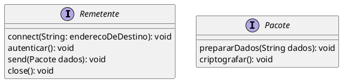
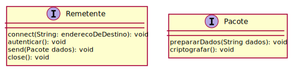
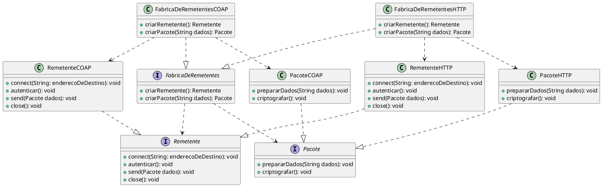
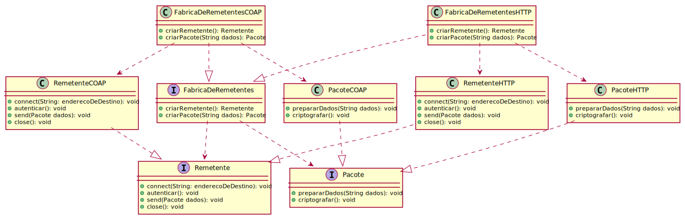
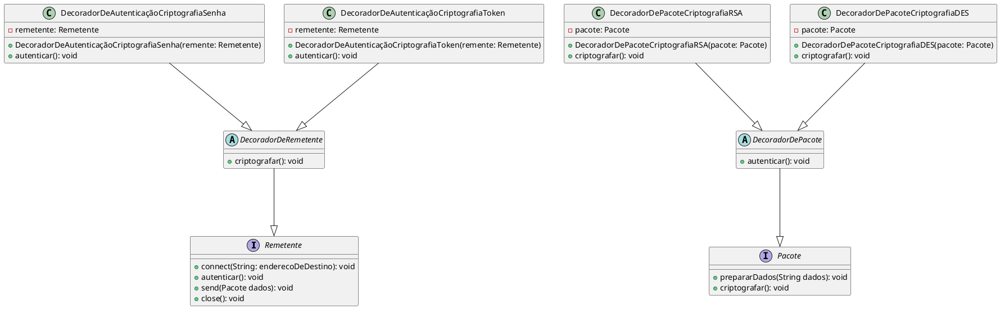
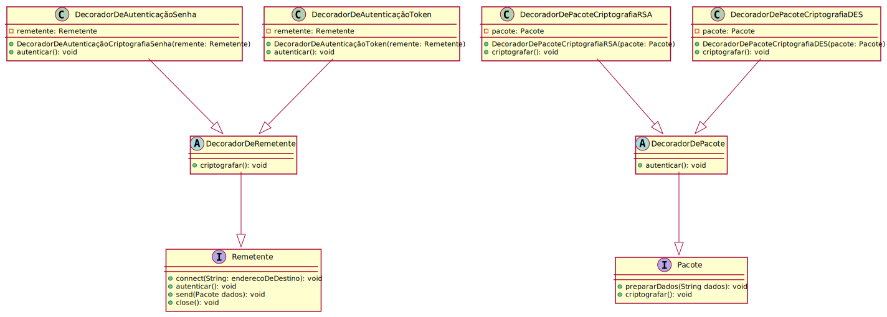

# Exercícios

Duas interfaces são definidas em um sistema para que ele possa enviar dados, estas interfaces
são as seguintes:

<!---

--->

A primeira diz respeito ao objeto que envia os dados (`Remetente`), a segunda diz respeito aos dados a serem enviados
na forma de um `Pacote`.

Como sabemos existem várias formas e protocolos para enviar dados. Queremos um
software flexível que possa utilizar diferentes protocolos, seja HTTP, COAP, MQTT, 
etc. Porém queremos que o nosso programa possa utilizar qualquer um desses 
protocolos de forma transparente (Nossa aplicação não se interessa pelo método
de envio, só quer enviar os dados.).

Utilize o padrão Abstract Factory para criar uma fábrica concreta para objetos
de um tipo de protocolo escolhido, por exemplo, se for HTTP, SendHTTP, PacoteHTTP.

<!---

--->

Com base nesses tipos crie os decoradores CriptografarPacoteDecorator e 
AutenticarRemetenteDecorator. E os decoradores concretos AutenticarRemetenteHTTPDecorator,
AutenticarRemetenteCOAPDecorator, CriptografarPacoteHTTPDecorator, 
CriptografarPacoteCOAPDecorator. Adapte a fábrica para criar decoradores para os
objetos concretos (ex. PacoteHTTP, RemetenteHTTP, PacoteCOAP, RemententeCOAP).

<!---

--->

Então devemos ter ao final:

- Uma Fábrica Abstrata definindo os tipos de objetos que podem ser criados.
- Duas fábricas concretas para objetos relacionados à HTTP e outra a COAP
- Decoradores para autenticar ou criptografar HTTP ou COAP.

Cada método deve apenas imprimir na tela a sua atividade, por exemplo:
1. "Criptografando simples"
2. "Autenticando complexo"
3. "Enviando com HTTP"

O programa deve perguntar ao usuário qual protocolo utilizar, depois
se quer utilizar criptografia simples, complexa ou nenhuma, depois autenticação
simples, complexa ou nenhuma. Depois ele irá "enviar"(imitar um envio apenas 
fazendo prints na tela) um pacote.
